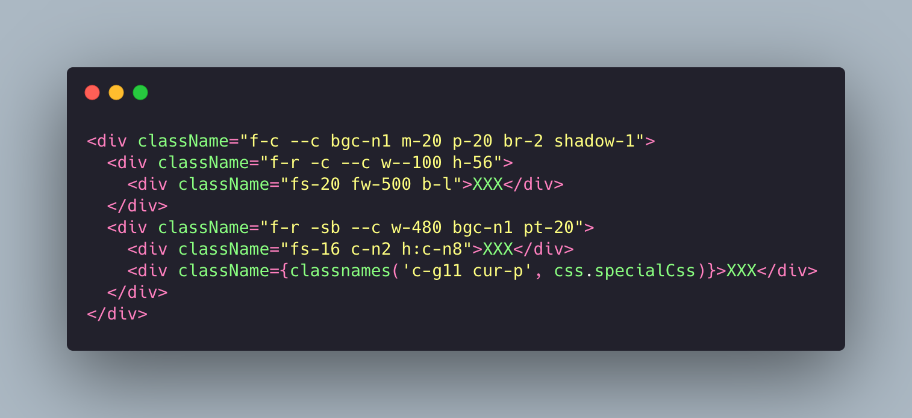

# quickcss
quickcss是一个能提高开发效率的针对web开发的轻量级acss库，只提供了在开发中使用最为频繁的css属性。解决了为一些简单样式的dom命名class想破头，写传统css又复杂还多的痛点。且与同为acss库的TailwindCSS相比，它并不算是一套完整的css库，它不包含伪类，选择器，动画等复杂低频使用的css属性，所以它需要与css module和scss或less等预编译css同时使用。不过它不需要记忆过多的语法糖，且上手快。quickcss本身也是用scss编写后编译成的css。




## 优势

* <b>轻量</b>。只提供了最为频繁使用的css属性，复杂css属性可结合scss或less一起使用。
* <b>方便</b>。不用再想愚蠢的类名，而仅仅是为了设置一个布局或者简单的单一样式。
* <b>易懂</b>。css样式都是根据原css写法进行缩写定义，符合大脑的记忆，且也对原有css样式记忆更加深刻。

## 引入与使用

``` 
// 引入
npm i @liuyuqin1991/quickcss

// 全局使用
import '@liuyuqin1991/quickcss/lib/main.css';
```

## 配置

> quickcss包含flex布局，边距，宽高，字体，颜色，边框，交互，溢出，层级，阴影，隐藏方式，伪类这12个大项

### 1. 布局
只用于控制flex布局类，仅包含对父容器的flex-direction，flex-wrap，justify-start，align-item这4个常用class以及对子容器flex:1这1个常用class，特殊flex布局除外。

#### 格式
* f-?： flex-direction与flex-wrap相关
* -?: 主轴对齐方式，justify-content相关
* --?: 从轴对齐方式，align-items相关

如下示例：
|   Class  | Properties  |
|  ----  | ----  |
| f-r  | flex-direction: row; |
| f-c  | flex-direction: column; |
| f-rr  | flex-direction: row-reverse; |
| f-cr  | flex-direction: column-reverse;|
| f-w  | flex-wrap: wrap; |
| f-nw  | flex-wrap: nowrap; |
| f-wr  | flex-wrap: wrap-reverse; |
| -s  | justify-content: flex-start; |
| -e  | justify-content: flex-end; |
| -c  | justify-content: center; |
| -sb  | justify-content: space-between; |
| -sa  | justify-content: space-around; |
| --s  | align-items: flex-start; |
| --e  | align-items: flex-end; |
| --c  | align-items: center; |
| --b  | align-items: baseline; |
| --st  | align-items: stretch; |
| f-1 | flex:1; |
| f-r -c --c  | flex-direction: row; justify-content: center; align-items: center;|
| f-c -sb --c  | flex-direction: row; justify-content: space-between; align-items: center;

### 2. 边距
控制元素内边距（padding）与外边距（margin）的功能类，m,mt,mr,mb,ml,mx,my（p,pt,pr,pb,pl,px,py）七个标准维度，在这七个维度上均定义了0-100以
<b> 4px </b>
自增，以及100-500以
<b> 10px </b>
自增的固定边距，
特殊边距除外。
#### 格式
* 维度-?：边距

如下示例：
|   Class  | Properties  |
|  ----  | ----  |
| p-0  | padding:0 |
| m-0  | margin:0 |
| pt-4  | padding-top:4px |
| mb-4  | margin-bottom:4px |
| pl-92  | padding-left:92px |
| mr-60  | margin-right:60px |
| pb-470  | padding-bottom:470px |
| ml-230  | margin-left:230px |
| px-12  | padding-left:12px; padding-right:12px |
| my-20  | margin-top:20px; margin-bottom:20px |

### 3. 宽度与高度
用来设置元素宽度（width）和高度（height）的功能类，均定义了0-500px以
<b> 1px </b>
自增的固定宽度与高度，0-100%以
<b> 1% </b>
自增的的百分比长度与高度，特殊宽度高度（例如calc(),rem，vh等）除外。
#### 格式
* w(h)-?: 固定宽度（高度）
* w(h)--?: 百分比宽度（高度）

如下示例：
|   Class  | Properties  |
|  ----  | ----  |
| w-0  | width:0 |
| h-52  | height:52px |
| w-246  | width:246px |
| h-480  | height:480px |
| w--14  | width:14% |
| h--100  | height:100% |

### 4. 字体
用来控制元素字体大小（font-size）和粗细（font-weight）的功能类，定义了12-100以
<b> 2px </b>
自增的固定字体大小和400-1500以
<b> 100 </b>
自增的固定字体粗细，特殊大小与粗细除外。

#### 格式
* fs-?: 字体大小
* fw-?: 字体粗细

如下示例：
|   Class  | Properties  |
|  ----  | ----  |
| fs-12  | font-size:12px |
| fw-500  | font-weight:500 |
| fs-18  | font-size:18px |
| fw-1200  | font-weight:1200 |

### 5. 颜色
用于控制元素的文字颜色（color），背景颜色（background-color）和边框颜色（border-color）的功能类。详细的颜色色系，色值及颜色变量可查看[色系颜色板](./color.md)，特殊颜色除外。

#### 格式
* c-?： 文本颜色
* bgc-?: 背景颜色
* bc-?: 边框颜色


注：这里x为颜色库中的色系值.为方便使用颜色css，这里可以通过在chrome中使用[chrome-figma-color插件](https://github.com/liuyuqin1991/chrome-extensions-figma-color)，能够在figma网页版设计稿中显示颜色色值对应的颜色变量（只看显示的第一个变量），然后会根据所对应的色系和色值来定x，例如，#324558对应的$neutral-15，色系为n（neutral），色值为15，那么x=n15，class即可以写成c-n15。

如下示例：

|   Class  | Properties  |
|  ----  | ----  |
| c-n8  |  color: $help2 |
| c-n15  |  color: $title3 |
| c-g11  |  color: $primary |
| c-g11  |  color: $primary |
| bc-n3  |  border-color: $border-color |
| bgc-n0  |  background-color: $white |

### 6. 边框
用于控制元素边框半径（border-radius）和边框厚度（border-width）的功能类，定义了1-10以
<b> 1px </b>
自增的边框半径和定义了1-10以
<b> 1px </b>
自增的边框厚度。定义了边框半径为1/4圆的1个特殊边框半径和3个常用特殊的边框样式。边框颜色见颜色类。

#### 格式
* br-?： 边框半径
* bw-?: 边框厚度
* b-?: 特殊边框（只包含3个特殊边框）

如下示例：

|   Class  | Properties  |
|  ----  | ----  |
| br-1  |  border-radius: 1px |
| br-8  |  border-radius: 8px |
| bw-1  |  border-width: 1px; |
| bw-5  |  border-width: 5px; |
| 特殊边框半径 |   |
| br--50  |  border-radius: 50% |
| 特殊边框（normal） |   |
| b-n |  border: 1px solid $border-color; |
| 特殊边框（light-normal） |   |
| b-ln |  border: 1px solid $light-border-color |
| 特殊边框（primary） |   |
| b-p |  border: 1px solid $primary; |

### 7. 交互
用于控制交互方面的功能类，持续的更新中，也会直接全部在示例中介绍

|   Class  | Properties  |
|  ----  | ----  |
| cur-p  |  cursor: pointer; |
| cur-w  |  cursor: wait; |
| cur-t  |  cursor: text; |
| cur-m  |  cursor: move; |
| cur-h  |  cursor: help; |
| cur-na  |  cursor: not-allowed; |

### 8. 溢出
用于控制元素溢出（overflow）的功能类，定义了overflow，overflow-x，overflow-y三个维度，auto，hidden，visible和scroll四个类型。

#### 格式
* o-?： xy轴溢出方式
* ox-?：x轴溢出方式
* oy-?：y轴溢出方式

如下示例：

|   Class  | Properties  |
|  ----  | ----  |
| o-a  |  overflow: auto; |
| o-h  |  overflow: hidden; |
| o-v  |  overflow: visible; |
| o-s  |  overflow: scroll; |
| ox-s  |  overflow-x: scroll; |
| oy-h  |  overflow-y: hidden; |

### 9. 层级
用于控制元素堆栈层级（z-index）的功能类，定义了0-100以
<b> 1 </b>
自增的z-index层级。

#### 格式
* z-?： 层级

如下示例：

|   Class  | Properties  |
|  ----  | ----  |
| z-1  |  z-index: 1; |
| z-11  |  z-index: 11; |
| z-57  |  z-index: 57; |
| z-100  |  z-index: 100; |

### 10. 阴影
用于控制元素的盒状阴影（box-shadow）的功能类，定义了常见的5种阴影类型

#### 格式
* shadow-?： 阴影

如下示例：

|   Class  | Properties  |
|  ----  | ----  |
| shadow-0  |  box-shadow: none; |
| shadow-1  |  box-shadow: 0px 1px 3px rgba(26, 30, 34, 0.08); |
| shadow-2  |  box-shadow: 0px 4px 6px rgba(3, 5, 7, 0.08); |
| shadow-3  |  box-shadow: 0px 5px 15px rgba(3, 5, 7, 0.08); |
| shadow-4  |  box-shadow: 0px 10px 24px rgba(3, 5, 7, 0.08); |
| shadow-5  |  box-shadow: 0px 15px 30px rgba(3, 5, 7, 0.08); |

### 11. 隐藏
用于控制元素如何隐藏的功能类，定义了元素移除(display: none)与元素不可见(visibility: hidden)两种隐藏方式.

#### 格式
* none: 元素移除
* hidden: 元素不可见

如下示例：

|   Class  | Properties  |
|  ----  | ----  |
| none  |  display: none; |
| hidden  |  visibility: hidden; |

### 12. 伪类
用于控制元素伪类的功能类，目前只定义了hover的常用效果

#### 格式
* h:c-? hover color
* h:bc-? hover border-color
* h:bgc-? hover background-color
* h:fs-? hover font-size
* h:fw-? hover font-weight

如下示例：

|   Class  | Properties  |
|  ----  | ----  |
| h:c-n8  |  &:hover{ color: $help2 } |
| h:bc-n3  |  &:hover { border-color: $border-color } |
| h:fs-14  |  &:hover { font-size: 14px } |


## 未来可能的计划

1. 评估并吸收更多的可简化的css类
2. 自定义主题色配置方案
3. 自适应方案
4. 伪类等特殊类方案

