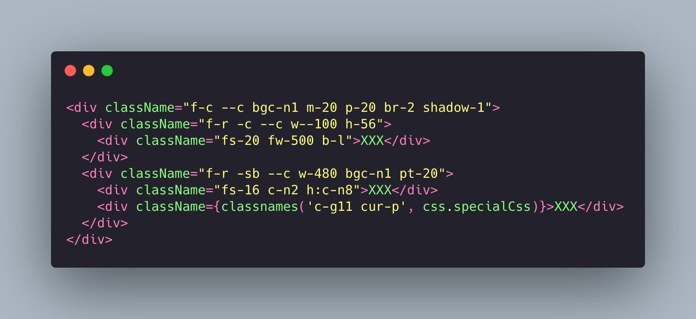

# quickcss

[中文](./README.md)

quickcss is a lightweight atomic CSS library specifically developed for web-oriented projects, providing the most convenient class name mnemonics for the most frequently used CSS properties.



## Advantages

- <b>Lightweight</b> - Only includes the most frequently used CSS properties. Complex CSS properties can be combined with SCSS or LESS
- <b>Convenient</b> - No need to invent class names just for simple layouts or single styles
- <b>Intuitive</b> - CSS styles follow shorthand definitions based on original CSS syntax, aligning with natural memorization and reinforcing CSS knowledge

## Installation & Usage

```
// Install
npm i @liuyuqin1991/quickcss

// Global import
import '@liuyuqin1991/quickcss/lib/main.css';
```

## Configuration

> quickcss covers 12 major categories: flex layout, spacing, dimensions, fonts, colors, borders, interactions, overflow, z-index, shadows, hiding methods, pseudo-classes, and positioning.

### 1. Layout

Controls flex layout classes. Includes 4 common classes for parent containers (`flex-direction`, `flex-wrap`, `justify-content`, `align-items`) and 1 class for child elements (`flex:1`). Special flex layouts are excluded.

#### Format

- f-?： Controls `flex-direction` and `flex-wrap`
- -?: Main axis alignment (`justify-content`)
- --?: Cross-axis alignment (`align-items`)
- ---?: Multi-line alignment (`align-content`)

Examples:
| Class | Properties |
| ---- | ---- |
| f-r | flex-direction: row; |
| f-c | flex-direction: column; |
| f-rr | flex-direction: row-reverse; |
| f-cr | flex-direction: column-reverse;|
| f-w | flex-wrap: wrap; |
| f-nw | flex-wrap: nowrap; |
| f-wr | flex-wrap: wrap-reverse; |
| -s | justify-content: flex-start; |
| -e | justify-content: flex-end; |
| -c | justify-content: center; |
| -sb | justify-content: space-between; |
| -sa | justify-content: space-around; |
| --s | align-items: flex-start; |
| --e | align-items: flex-end; |
| --c | align-items: center; |
| --b | align-items: baseline; |
| --st | align-items: stretch; |
| ---s | align-content: flex-start; |
| ---e | align-content: flex-end; |
| ---c | align-content: center; |
| ---sb | align-content: space-between; |
| ---sa | align-content: space-around; |
| f-1 | flex:1; |
| f-r -c --c | flex-direction: row; justify-content: center; align-items: center;|
| f-c -sb --c | flex-direction: row; justify-content: space-between; align-items: center;

### 2. Spacing

Controls padding (`p`) and margin (`m`) with 7 standard dimensions: `m, mt, mr, mb, ml, mx, my` (and `p, pt, pr, pb, pl, px, py`). Defines values from 0-100 with **4px** increments and 100-500 with **10px** increments ,exceptions excluded.

#### Format

- [dimension]-?: Spacing value

Examples:
| Class | Properties |
| ---- | ---- |
| p-0 | padding:0 |
| m-0 | margin:0 |
| pt-4 | padding-top:4px |
| mb-4 | margin-bottom:4px |
| pl-92 | padding-left:92px |
| mr-60 | margin-right:60px |
| pb-470 | padding-bottom:470px |
| ml-230 | margin-left:230px |
| px-12 | padding-left:12px; padding-right:12px |
| my-20 | margin-top:20px; margin-bottom:20px |

### 3. Width & Height

Sets element `width` and `height`. Defines fixed pixel values (0-500px with **1px** increments) and percentage values (0-100% with **1%** increments). Excludes special units like `calc()`, `rem`, `vh`.

#### Format

- w(h)-?: Fixed width/height
- w(h)--?: Percentage width/height

Examples:
| Class | Properties |
| ---- | ---- |
| w-0 | width:0 |
| h-52 | height:52px |
| w-246 | width:246px |
| h-480 | height:480px |
| w--14 | width:14% |
| h--100 | height:100% |

### 4. Font

Controls font size (`font-size`) and weight (`font-weight`). Defines font sizes from 12-100px (**2px** increments) and weights from 400-1500 (**100** increments).

#### Format

- fs-?: Font size
- fw-?: Font weight

Examples:
| Class | Properties |
| ---- | ---- |
| fs-12 | font-size:12px |
| fw-500 | font-weight:500 |
| fs-18 | font-size:18px |
| fw-1200 | font-weight:1200 |

### 5. Color

Controls text color (`color`), background color (`background-color`), and border color (`border-color`). Detailed color palette and variables can be found in the [color scheme documentation](./color.md).

#### Format

- c-?： Text color
- bgc-?: Background color
- bc-?: Border color

Examples:

| Class  | Properties                  |
| ------ | --------------------------- |
| c-n8   | color: $help2               |
| c-n15  | color: $title3              |
| c-g5  | color: #87d7bc             |
| c-g11  | color: $primary             |
| bc-n3  | border-color: $border-color |
| bgc-n0 | background-color: $white    |

### 6. Border

Controls `border-radius` and `border-width`. Defines radius values 1-10px (**1px** increments) and width values 1-10px (**1px** increments) . Defines one special border radius equivalent to a quarter-circle and three commonly used special border styles. For border colors, refer to the color classes.

#### Format

- br-?： Border radius
- bw-?: Border width
- b-?: Special border styles（includes 3 special border）

Examples:

| Class                    | Properties                            |
| ------------------------ | ------------------------------------- |
| br-1                     | border-radius: 1px                    |
| br-8                     | border-radius: 8px                    |
| bw-1                     | border-width: 1px;                    |
| bw-5                     | border-width: 5px;                    |
| special border(quarter-circle) |                                       |
| br--50                   | border-radius: 50%                    |
| special border(normal)        |                                       |
| b-n                      | border: 1px solid $border-color;      |
| special border(light-normal)  |                                       |
| b-ln                     | border: 1px solid $light-border-color |
| special border(primary)       |                                       |
| b-p                      | border: 1px solid $primary;           |

### 7. Interaction

Controls interaction-related styles (continuously updated).

| Class  | Properties           |
| ------ | -------------------- |
| cur-p  | cursor: pointer;     |
| cur-w  | cursor: wait;        |
| cur-t  | cursor: text;        |
| cur-m  | cursor: move;        |
| cur-h  | cursor: help;        |
| cur-na | cursor: not-allowed; |

### 8. Overflow

Controls overflow behavior for `overflow`, `overflow-x`, `overflow-y` and `auto`,`hidden`,`visible`,`scroll` 4 types.

#### Format

- o-?： both axis
- ox-?：X-axis
- oy-?：Y-axis

Examples:

| Class | Properties          |
| ----- | ------------------- |
| o-a   | overflow: auto;     |
| o-h   | overflow: hidden;   |
| o-v   | overflow: visible;  |
| o-s   | overflow: scroll;   |
| ox-s  | overflow-x: scroll; |
| oy-h  | overflow-y: hidden; |

### 9. Z-Index

Controls stacking order with `z-index` values 0-100 (**1** increment).

#### Format

- z-?： Z-Index

Examples:

| Class | Properties    |
| ----- | ------------- |
| z-1   | z-index: 1;   |
| z-11  | z-index: 11;  |
| z-57  | z-index: 57;  |
| z-100 | z-index: 100; |

### 10. Shadow

Controls `box-shadow` with 5 predefined types.

#### Format

- shadow-?： box-shadow

Examples:

| Class    | Properties                                      |
| -------- | ----------------------------------------------- |
| shadow-0 | box-shadow: none;                               |
| shadow-1 | box-shadow: 0px 1px 3px rgba(26, 30, 34, 0.08); |
| shadow-2 | box-shadow: 0px 4px 6px rgba(3, 5, 7, 0.08);    |
| shadow-3 | box-shadow: 0px 5px 15px rgba(3, 5, 7, 0.08);   |
| shadow-4 | box-shadow: 0px 10px 24px rgba(3, 5, 7, 0.08);  |
| shadow-5 | box-shadow: 0px 15px 30px rgba(3, 5, 7, 0.08);  |

### 11. Hiding

Controls element hiding type，Defines type `display: none` and `visibility: hidden`.

#### Format

- none: Removes element
- hidden: Hides element

Examples:

| Class  | Properties          |
| ------ | ------------------- |
| none   | display: none;      |
| hidden | visibility: hidden; |

### 12. Pseudo-classes

Controls hover effects.

#### Format

- h:c-? hover text color
- h:bc-? hover border color
- h:bgc-? hover background color
- h:fs-? hover font size
- h:fw-? hover font weight

Examples:

| Class   | Properties                              |
| ------- | --------------------------------------- |
| h:c-n8  | &:hover{ color: $help2 }                |
| h:bc-n3 | &:hover { border-color: $border-color } |
| h:fs-14 | &:hover { font-size: 14px }             |

### 13. Position

Controls element position.

#### Format

- pos-?： Position

Examples:

| Class    | Properties                                      |
| -------- | ----------------------------------------------- |
| pos-r | position: relative;  |
| pos-a | position: absolute;  |
| pos-f | position: fixed;  |
| pos-s | position: sticky;  |

## Future Plans

1. Evaluate and integrate more simplified CSS classes
2. Custom theme color configuration
3. Responsive design solutions
4. Enhanced pseudo-class solutions
